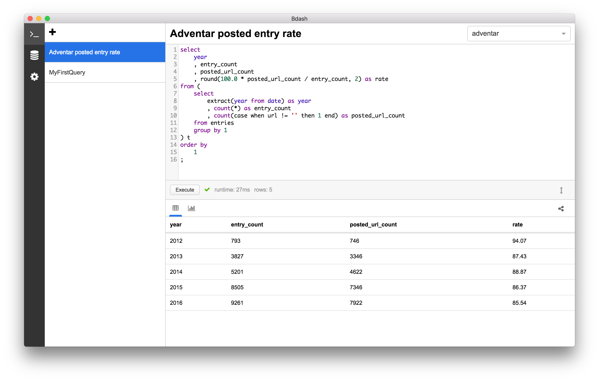
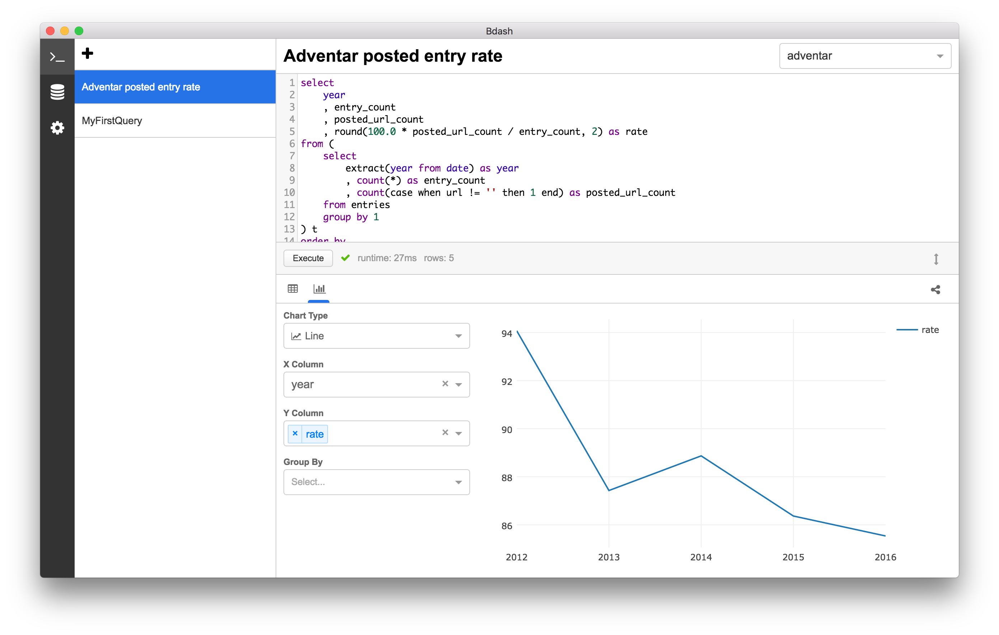

# Bdash

A modern SQL client application.

## Feature

### Saving query



### Drawing chart



### Sharing result

You can share the result with gist.

https://gist.github.com/hokaccha/e128e1c3a68527ebf2c50d5e95a089b1

### Multiple data sources support

- [x] MySQL
- [x] PostgreSQL (Redshift)
- [x] BigQuery
- [ ] Amazon Athena
- [x] Treasure Data
- [ ] Hive
- [ ] Impala
- [ ] Presto
- [ ] Microsoft SQL Server
- [ ] And more!

## Installation

You can download and install from [GitHub release](https://github.com/bdash-app/bdash/releases).

## Update

Automatic update is not implemented yet. Download and override from [GitHub release](https://github.com/bdash-app/bdash/releases) manually.

## Support platform

- [x] macOS
- [x] Windows
- [ ] Linux

## Development

You can start the application with following commands.

```
$ npm install -g yarn
$ cd bdash
$ yarn
$ npm run build:sqlite3

# Run following commands with different shell processes.
$ npm run watch
$ npm start
```

After changing the code, you can reload with `⌘+R` to apply the change.

## License

MIT
